# AppVideo

Proyecto realizado para la asignatura de <b>Tecnologicas de Desarrollo de Software</b> de 3º de Ingenieria Informática en la Universidad de Murcia.

<b>Profesor: </b> Jesús Joaquin Garcia Molina

El objetivo de este proyecto es desarrollar un programa que gestione una serie de videos de YouTube, con la opcion de reproducirlos, crear listas, realizar busquedas...

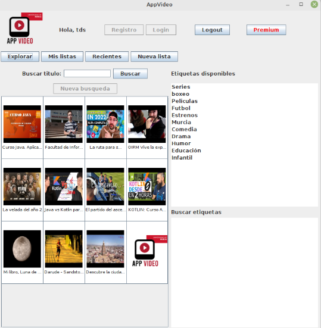

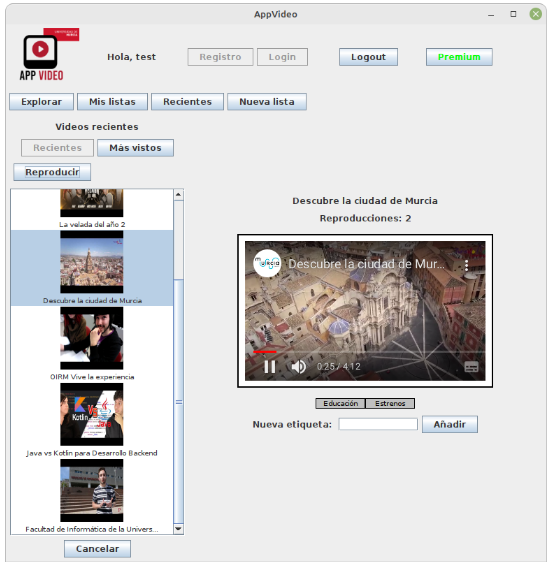

# Uso

Para poder utilizar la aplicación, es necesario hacer uso de un Servidor de Persistencia.

Lo puedes encontrar en la carpeta "/ServidorPersistencia"

```console
enrique@pc:~$ cd ./ServidorPersistencia
enrique@pc:~$ java -jar ./ServidorPersistenciaH2.jar 

Objetos distribuidos listos : FactoriaServicioPersistencia
Presionar ENTER para salir (los objetos distribuidos seran destruidos)...
```
Ahora ya puedes ejecutar el proyecto, existe una clase Lanzador para facilitar el proceso.

# Diagramas
## Diagrama de clases
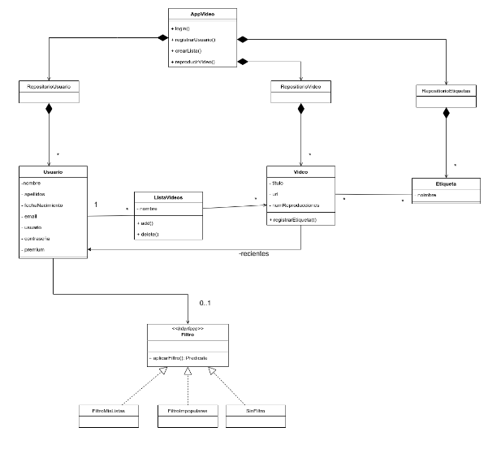
## Colaboración insertar video en lista
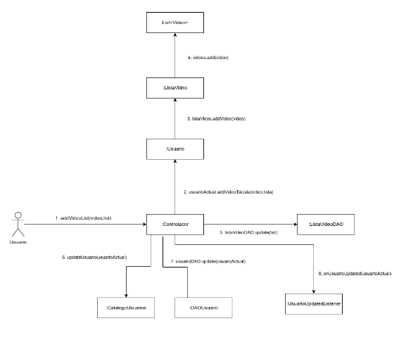


# Arquitectura

La aplicación se divide principalmente en  tres capas (Presentación, Lógica de Negocio y Almacenamiento).

## Presentación
Clases relacionadas con la interfaz, por ejemplo, las clases que representan paneles, adaptadores de listas y tablas, etc. Principalmente se localizan en el paquete (umu.tds.AppVideo.gui)

Para la navegación he utilizado CardLayout y he creado un controlador para la interfaz (“ControladorUI”) que se encarga de navegar por los diferentes “cards” de la aplicación.

## Lógica
Aquí se encuentra la parte donde se gestionan las reglas de negocio. Sobre todo, el eje central de esta capa es el Controlador, que es el que se encarga en esencia de comunicar la Presentación con el Almacenamiento.

También se incluye aquí las clases relacionadas con los objetos del dominio (modelos) 

## Almacenamiento
En esta capa se incluyen los catálogos y los diferentes DAO que permiten la persistencia en una base de datos. En este caso se utiliza la base de datos H2, pero al usar el patrón DAO sería muy sencillo hacer futuras migraciones a otras bases de datos al estar muy desacoplado. 

Además, se incluyen unos Seeders que generan una base de datos inicial para que funcione la aplicación (videos y etiquetas)

# Patrones de diseño

## Método Factoría
Es utilizado para la creación de diferentes DAO.

```java
public static FactoriaDAO getInstance(String type) {
		
		if(instance==null) {
			try {
				instance = (FactoriaDAO) Class.forName(type).getConstructor().newInstance();
			} catch (InstantiationException | IllegalAccessException | IllegalArgumentException
					| InvocationTargetException | NoSuchMethodException | SecurityException
					| ClassNotFoundException e) {
				e.printStackTrace();
			}
		}
		
		return instance;
	}
```

## Singleton
Es utilizado prácticamente en todo el código, necesario para los diferentes catálogos, factorías, controladores… Un caso muy interesante es el del reproductor, que por limitaciones en dicho componente (videoWeb) solo puede tener una instancia al mismo tiempo.

```java
public class SingletonReproductor {

	private static VideoWeb instance;
	
	public static VideoWeb getInstance() {
		if(instance==null) {
			instance = new VideoWeb();
		}
		instance.cancel();
		return instance;
	}
}
```

##  Adaptador
Necesario por ejemplo para poder usar UI cómo vistas y tablas de forma personalizada.

```java
public interface UsuarioDAO {
	void create(Usuario usuario);
	List<Usuario> getUsuarios();
	void update(Usuario usuario);
}
```
```java
public class TDSUsuarioDAO implements UsuarioDAO{

	
	// Constantes Atributos
	
	private static final String USUARIO = "Usuario";

	private static final String NOMBRE = "nombre";
	private static final String APELLIDOS = "apellidos";
	private static final String FECHA_NACIMIENTO = "fechaNacimiento";
	private static final String EMAIL = "email";
	private static final String USERNAME = "username";
	private static final String PASSWORD = "password";
	private static final String LISTAS_VIDEOS = "listasVideos";
	private static final String VIDEOS_RECIENTES = "videosRecientes";
	private static final String PREMIUM = "premium";
	private static final String FILTRO = "filtro"
```

## MDE (modelo delegación eventos)
Usado para poder comunicar los diferentes eventos importantes que suceden en el sistema. (Ejemplo: Cuando un usuario se logea, cuando se actualiza el usuario, cuando se crea una nueva lista…)
```java
public interface UsuarioLoggedListener {
	void onUsuarioLogged(Usuario u);
	void onUsuarioLogout(Usuario u);
}
```


# Desarrollo

## Antes de hacer Git Push

Es recomendable hacer mvn clean para mantener limpio el repositorio.

```console
enrique@pc:~$ mvn clean
enrique@pc:~$ git push
```

# Screenshots
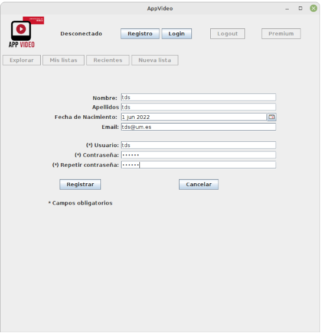
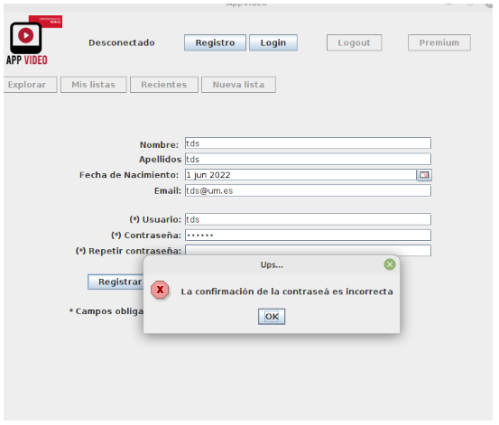
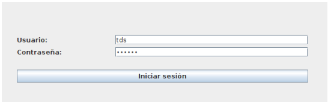
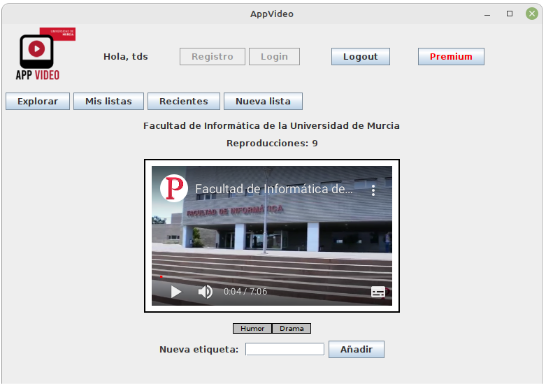
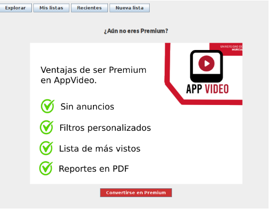
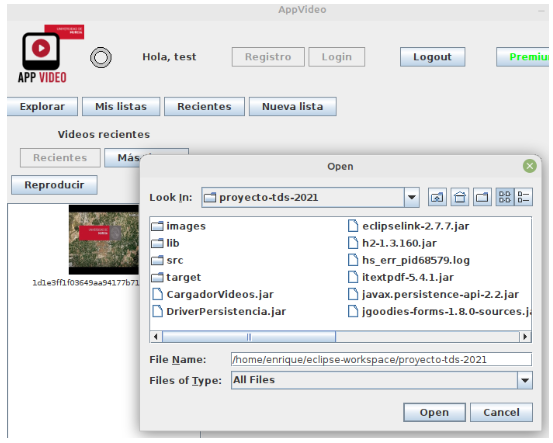
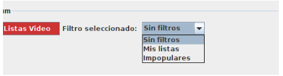
